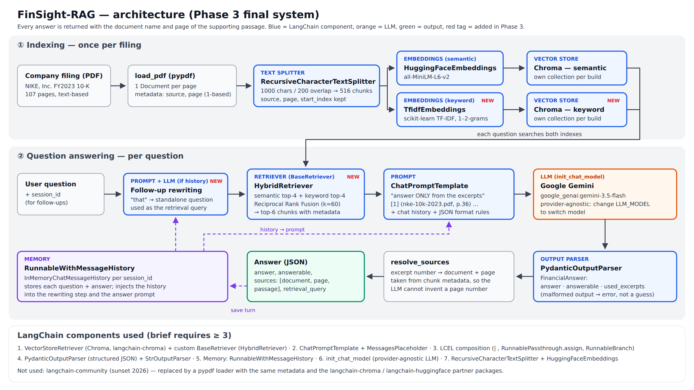

# FinSight-RAG
### A Source-Grounded Question-Answering Assistant for Corporate Financial Filings

**Lab 9 PSIS — Activity 1: RAG-Based Domain Assistant (Financial Report Analyzer)**
SVKM's NMIMS MPSTME, B.Tech AI · Akash Goyal (I025) · Karan Lokhande (I039) · Meer Magia (I040) · **Status: Phase 3 — final submission**

FinSight-RAG answers natural-language questions about a company's annual report / SEC 10-K and returns every
answer with the **document name and page number** of the supporting passage. If the filing does not contain the
answer, it says so (`answerable: false`) instead of guessing.

**Colab (Phase 3, final):** [open FinSight_RAG_Phase3.ipynb](https://colab.research.google.com/github/akashgoyalll/finsight-rag-I025-39-40/blob/main/notebooks/FinSight_RAG_Phase3.ipynb) ·
Phase 2 notebook: [FinSight_RAG_Phase2.ipynb](https://colab.research.google.com/github/akashgoyalll/finsight-rag-I025-39-40/blob/main/notebooks/FinSight_RAG_Phase2.ipynb)

## Architecture


| LangChain component | Where | Role |
|---|---|---|
| `RecursiveCharacterTextSplitter` | `src/finsight/indexing.py` | 1000-char chunks, 200 overlap, page metadata kept |
| `HuggingFaceEmbeddings` + Chroma `VectorStoreRetriever` | `indexing.py` | semantic search (all-MiniLM-L6-v2) |
| Custom `BaseRetriever` — `HybridRetriever` | `src/finsight/hybrid.py` | semantic + keyword (TF-IDF) fused by Reciprocal Rank Fusion |
| `ChatPromptTemplate` + `MessagesPlaceholder` | `src/finsight/chain.py` | numbered excerpts labelled `(document, p.N)`; answer only from them |
| LCEL (`\|`, `RunnablePassthrough.assign`, `RunnableBranch`) | `chain.py` | rewrite follow-up → retrieve → prompt → LLM → parse → cite |
| `init_chat_model` | `src/finsight/llm.py` | Gemini by default; any provider via `LLM_MODEL` |
| `PydanticOutputParser` | `chain.py` | JSON `{answer, answerable, used_excerpts}` |
| `RunnableWithMessageHistory` | `chain.py` | multi-turn memory per `session_id` |

Citations are attached **from chunk metadata**: the model only reports which numbered excerpts it used, so it
cannot invent a page number.

### What changed in Phase 3
1. **LLM connected:** Google Gemini (`google_genai:gemini-3.5-flash`) through `init_chat_model`.
2. **Hybrid retrieval:** Phase 2 showed the semantic and keyword retrievers fail on *different* questions
   (semantic missed the exact employee count; keyword was misled by segment tables). `HybridRetriever` fuses both
   ranked lists with Reciprocal Rank Fusion and passes the top-6 chunks to the prompt.
3. **Follow-up rewriting (history-aware retrieval):** memory alone did not help retrieval: a follow-up like
   *"How much did that grow?"* was searched literally. With chat history, the LLM now rewrites it into a standalone
   question before retrieval.
4. **Bug fix — duplicated index:** Chroma's in-process clients share state, so building the index twice in one
   Python session appended to the same collection (516 → 1032 chunks, duplicate results). Each build now gets
   its own collection (regression test added).
5. **Evaluation:** a 7th, unanswerable control question (FY2025 revenue) and `scripts/run_phase3.py`, which compares
   retrievers, generates answers with the Phase 2 baseline and the final system, runs automatic checks and the
   multi-turn test, and saves everything to `outputs/`.

## Quick start (terminal)
```bash
git clone https://github.com/akashgoyalll/finsight-rag-I025-39-40.git && cd finsight-rag-I025-39-40
pip install -r requirements.txt
bash scripts/get_data.sh                               # downloads the NIKE FY2023 10-K (107 pages)
python -m pytest tests/ -v                             # 11 tests, offline, no API key needed
export GOOGLE_API_KEY=...                              # Gemini key from Google AI Studio (never commit it)
python scripts/run_phase3.py                           # full evaluation -> outputs/phase3_*.{json,md}; resumable, free-tier paced
python scripts/ask.py "What were NIKE's total revenues in fiscal 2023?" "How much did that grow on a currency-neutral basis?"
```
Other providers: `pip install langchain-<provider>` and set `LLM_MODEL="<provider>:<model>"` plus that provider's key.

## Data
Development filing: **NIKE, Inc. FY2023 Form 10-K** (107 pages, all text-extractable), the example filing from
LangChain's official RAG tutorial. Any text-based 10-K / annual report PDF can be placed in `data/`. Scanned PDFs are
not supported (pypdf has no OCR).

## Test questions
`tests/questions.json`: 7 questions whose answers were checked against the filing by hand.

| Q | Type | Ground truth (page) |
|---|---|---|
| Q1 | numeric lookup | $51.2 billion, +10% (+16% currency-neutral) (pp. 31, 36, 39) |
| Q2 | factual lookup | ≈ 83,700 employees (p. 9) |
| Q3 | numeric + explanation | gross margin −250 bps to 43.5% (p. 37) |
| Q4 | numeric lookup | NIKE Direct +14%, $18.7B → $21.3B (pp. 31, 36) |
| Q5 | narrative / risk | foreign-exchange risk discussion (pp. 13–14, 46) |
| Q6 | multi-hop calculation (**expected weak case**) | Greater China, 31.5% = 2,283 / 7,248 (computed from p. 39) |
| Q7 | unanswerable control | not in the filing → `answerable: false` |

## Results (Phase 3, Google Colab, `gemini-3.5-flash`, 1 Oct 2026)
Full output: [`outputs/phase3_summary.md`](outputs/phase3_summary.md), log `outputs/phase3_log_colab.txt`, executed notebook
`notebooks/FinSight_RAG_Phase3_executed_colab.ipynb`. Manual grounding review and discussion: [technical report](docs/FinSight-RAG_Technical_Report.pdf).

**Retrieval (Q1–Q6)**: HIT = evidence string found in the retrieved chunks.

| Retriever | Q1 | Q2 | Q3 | Q4 | Q5 | Q6 | Hit-rate |
|---|---|---|---|---|---|---|---|
| Semantic top-4 (Phase 2) | HIT | miss | HIT | HIT | miss* | HIT | 4/6 |
| Keyword (TF-IDF) top-4 | miss | HIT | HIT | HIT | HIT | miss | 4/6 |
| Semantic / keyword top-6 | | | | | | | 4/6 each |
| **Hybrid RRF top-4 / top-6** | HIT | HIT | HIT | HIT | HIT | HIT | **6/6** |

\* False negative of the string check: the retrieved p. 46 is relevant but lacks the exact phrase.

**Answers (Q1–Q7)**, same prompt and model, only the retriever changed:

| | Correct | Notes |
|---|---|---|
| Phase 2 retriever (semantic top-4) | 6/7 | Q2: p. 9 not retrieved → "excerpts do not contain" (safe but wrong) |
| **Final system (hybrid top-6)** | **7/7** | every figure found on the cited page; Q7 (FY2025, not in filing) declined with `answerable=false` |

The designed weak case Q6 (segment EBIT margins, not stated in the filing) passed: the model computed Greater China 31.50%,
APLA 30.04%, EMEA 26.31%, North America 25.24% from p. 39. Multi-turn: the follow-up "How much did that grow on a
currency-neutral basis?" was rewritten to a standalone query and answered 16% (correct). Without rewriting it was also correct in this test.

## Limitations
Single filing indexed; pypdf flattens tables into text (Q6 relies on the LLM's own arithmetic); evaluation set is small (7 questions) and the automatic
checks are string-based (backed by a manual review); `RunnableWithMessageHistory` is deprecated in
langchain-core 1.6 (works, but LangChain now recommends LangGraph persistence); memory is in-process only.

## Repository layout
```
src/finsight/  loader.py · embeddings.py · indexing.py · hybrid.py · chain.py · llm.py
scripts/       run_phase3.py · ask.py · run_retrieval_demo.py · get_data.sh
tests/         test_pipeline.py (11 tests) · questions.json
notebooks/     FinSight_RAG_Phase3.ipynb (final) · FinSight_RAG_Phase3_executed_colab.ipynb · FinSight_RAG_Phase2.ipynb
docs/          architecture.png / .svg · FinSight-RAG_Technical_Report.pdf
outputs/       run logs and JSON results (Phase 2 and Phase 3)
```
